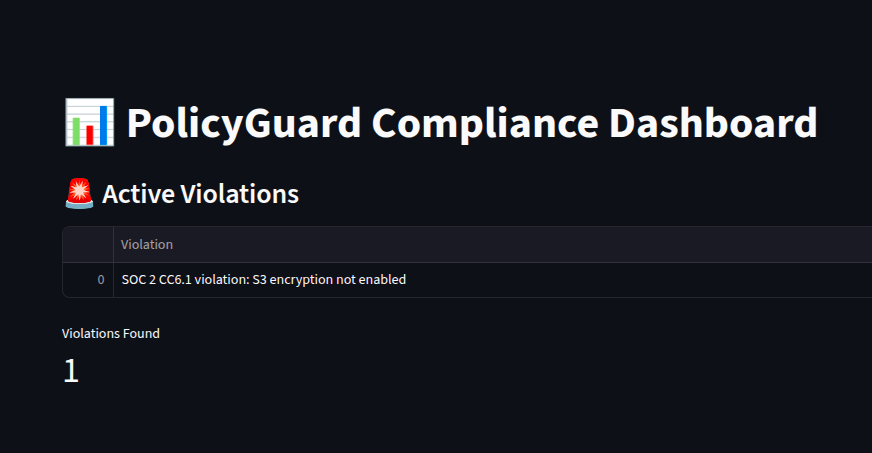

# PolicyGuard Compliance Platform



## Overview

PolicyGuard is an automated compliance auditing and dashboard platform designed to help organizations maintain continuous cloud security compliance with frameworks such as **SOC 2**, **PCI DSS**, **HIPAA**, and customizable policy sets. 

By integrating **Open Policy Agent (OPA)** for policy-as-code enforcement and leveraging **Streamlit** for an interactive, real-time dashboard, PolicyGuard provides security teams and auditors with actionable insights and visibility into active violations and historical compliance trends.

---

## Features Completed

- **Policy-as-Code with OPA:**  
  Developed custom Rego policies for SOC 2 controls (e.g., S3 encryption, approved AMIs).  
  Policies are evaluated against live or sample input data to detect violations.

- **Automated Compliance Evaluation:**  
  CLI integration to run OPA evaluations on Terraform plans or resource snapshots, generating JSON reports of policy violations.

- **Interactive Dashboard:**  
  Built with Streamlit, the dashboard visualizes active compliance violations in an intuitive web UI, with status updates and summaries.

- **GitHub Integration:**  
  Hosted the project on GitHub with automated workflows for policy evaluation and report generation (CI/CD readiness).

---

## Planned Enhancements

- **Expand Policy Coverage:**  
  Add support for additional compliance standards such as **PCI DSS**, **HIPAA**, and custom organizational policies.

- **Historical Trends & Reporting:**  
  Extend the dashboard with historical data tracking, filters, and exportable compliance reports for audit readiness.

- **Terraform/Kubernetes Integration:**  
  Automate scanning of infrastructure-as-code plans for compliance drift before deployment.

- **Alerting & Remediation:**  
  Integrate ticketing systems and alert hooks to facilitate immediate response and remediation workflows.

- **Documentation & Usability:**  
  Polish documentation, add example inputs, user guides, and developer onboarding instructions.

---

## Getting Started

1. Clone the repository  
   ```bash
   git clone https://github.com/your-username/policyguard-compliance-platform.git
   cd policyguard-compliance-platform
